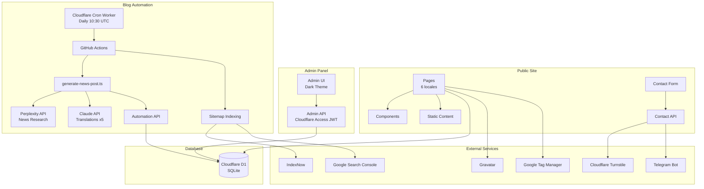

# IT Guys Website

Corporate website for [itguys.ro](https://itguys.ro) — an IT services company. Built with Next.js 16 on Cloudflare Workers, with a multilingual public site (6 locales), admin panel, and automated blog generation.

## Architecture



## Tech Stack

| Layer | Technology |
|-------|-----------|
| Framework | Next.js 16 (App Router) + React 19 |
| Styling | Tailwind CSS v4 |
| Database | Cloudflare D1 (SQLite) |
| Deployment | Cloudflare Workers via @opennextjs/cloudflare |
| Auth | Cloudflare Access (JWT) |
| Package Manager | pnpm |

## Setup

1. Install dependencies:
   ```bash
   pnpm install
   ```

2. Copy environment files:
   ```bash
   cp .env.example .env.local
   cp wrangler.toml.example wrangler.toml
   ```

3. Fill in secrets in `wrangler.toml` and public keys in `.env.local`.

4. Initialize the local database:
   ```bash
   pnpm db:migrate:local
   ```

## Development

```bash
pnpm dev              # Build + run Cloudflare worker locally
pnpm db:migrate:local # Run all D1 migrations locally
pnpm lint             # ESLint
```

Local D1 data is stored in `.wrangler/state/`.

Admin panel is available at `/admin` (auth bypassed locally via `ADMIN_DEV_BYPASS=true`).

## Deployment

Push to `master` triggers the GitHub Actions deploy workflow:

1. Install deps + build Next.js
2. Run D1 migrations (skips already-applied)
3. Deploy main worker + blog-trigger cron worker

Manual blog post generation:
```bash
pnpm tsx scripts/generate-news-post.ts
```

## Project Structure

```
src/
├── app/
│   ├── (en)/              # English pages (default, no /en prefix)
│   ├── [locale]/          # Localized pages (ro, fr, de, it, es)
│   ├── admin/             # Admin panel (CRUD for all entities)
│   └── api/
│       ├── contact/       # Contact form handler
│       ├── automation/    # Blog automation endpoint
│       └── admin/         # Admin CRUD API routes
├── components/
│   ├── admin/             # DataTable, FormField, MarkdownEditor, etc.
│   ├── layout/            # Header, Footer
│   ├── ui/                # Button, Card, Carousel, etc.
│   ├── sections/          # Hero, CTA, ContactForm
│   ├── illustrations/     # SVG illustrations
│   ├── providers/         # Theme, CookieConsent
│   └── structured-data/   # Schema.org JSON-LD
├── content/               # Static page copy per locale
├── i18n/                  # Localization config + Link/Router
└── lib/
    ├── db/                # D1 client, schema types, query functions
    ├── admin-auth.ts      # Cloudflare Access JWT validation
    ├── gravatar.ts        # Avatar URLs
    ├── indexnow.ts        # SEO submission
    └── utils.ts           # cn(), getCombinedYears(), generateSlug()

migrations/                # 25 SQL migration files
scripts/                   # Blog post generator
workers/blog-trigger/      # Cloudflare cron worker
```

## Localization

**Locales:** en (default), ro, fr, de, it, es

Routes have translated paths and slugs per locale:
- `/services` → `/ro/servicii`, `/de/dienstleistungen`, `/it/servizi`
- `/services/consulting` → `/ro/servicii/consultanta`, `/fr/services/conseil`
- `/about` → `/ro/despre-noi`, `/de/ueber-uns`, `/it/chi-siamo`

Database translations use `COALESCE` to fall back to English when a locale translation is missing.

## Environment Variables

**Public** (`.env.local`):
- `NEXT_PUBLIC_TURNSTILE_SITE_KEY` — Cloudflare Turnstile
- `NEXT_PUBLIC_GTM_ID` — Google Tag Manager
- `NEXT_PUBLIC_GOOGLE_SITE_VERIFICATION` — Search Console

**Secrets** (`wrangler.toml`):
- `TELEGRAM_BOT_TOKEN` / `TELEGRAM_CHAT_ID` — Contact notifications
- `TURNSTILE_SECRET_KEY` — Turnstile server-side validation
- `INDEXNOW_KEY` — SEO index submission
- `AUTOMATION_API_KEY` — Blog automation API auth

## Notes

- Image optimization is disabled for Cloudflare Workers compatibility
- Build is limited to 1 CPU core due to memory constraints
- All pages use `force-dynamic` since D1 is unavailable at build time
