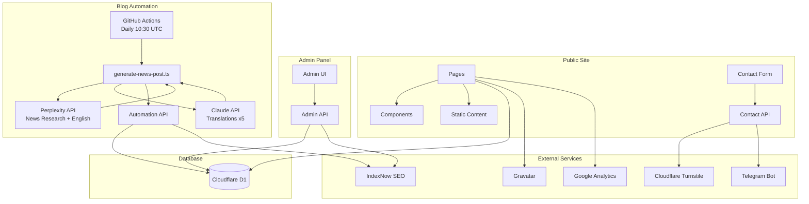

# IT Guys Website

Next.js website deployed to Cloudflare Workers.

## Architecture



## Setup

1. Install dependencies:
   ```bash
   npm install
   ```

2. Copy environment files:
   ```bash
   cp .env.example .env
   cp wrangler.toml.example wrangler.toml
   ```

3. Configure environment variables in `.env`:
   - `TELEGRAM_BOT_TOKEN` / `TELEGRAM_CHAT_ID` - Contact form notifications
   - `NEXT_PUBLIC_TURNSTILE_SITE_KEY` / `TURNSTILE_SECRET_KEY` - Spam protection

## Development

```bash
npm run dev
```

## Deployment

Build and deploy to Cloudflare:
```bash
npm run build:cloudflare
npm run deploy
```

Or preview locally with Wrangler:
```bash
npm run preview
```
